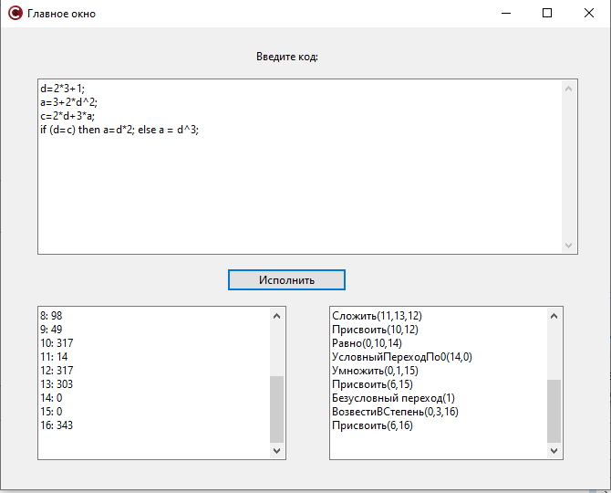

# Построение транслятора
## Описание

Данная программа реализует МП-транслятор для следующей грамматики:

Оператор присваивания: 
<идентификатор>=<ар.выр.>; 
 
Условный оператор: 
If (<лог.выр.>) then <оператор>[else <оператор>] 
 
Оператор цикла: 
ЦИКЛ_ПОКА (<лог.выр.>) 
<совокупность операторов> 
КОНЕЦ  

Арифметическое выражение: 
\<E>::= <T><E-список>    
<E- список >::= +<T><E- список> 
<E- список>::=Ɛ 
\<T>::=<F><T- список> 
<T- список>::= *<F><T- список> 
<T- список>::=Ɛ 
\<F>::=\
 
\<F>::=\<R> 
\
::=Id 
\
::=Int 
\<R>::=\
^\
 
 
Логическое выражение: 
<лог.выр.>::=\
<лог.опер.>\
 
<лог.опер.>::= = 
<лог.опер.>::= # 

## Использование

Программа написана как приложение с графическим интерфейсом в среде Embarcadero C++ Builder.

  Пример работы программы:

  

